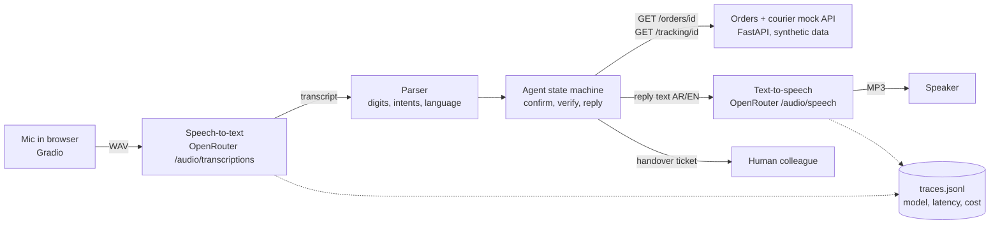

# voice-order-agent

A phone-style voice assistant that tells customers their order status in **Arabic or
English**. It confirms the order number digit by digit, checks the caller, and hands over
to a person when asked or when it cannot help. Every stage of every turn is timed.

## Demo

Demo video/Space: pending — to be recorded by Sara.

The Gradio app (`app/app.py`) takes microphone input and shows the transcript, the tool
calls and the latency of each stage. Without an API key you can still type to the agent.

## The problem

Many order-status calls to an online shop ask one question: "where is my order?". In the
Gulf, those calls come in Arabic and English, often mixing both. A voice bot can answer
them at any hour, but only if it:

- hears order numbers correctly (one wrong digit means the wrong customer's order),
- never reads out an order to someone who cannot prove it is theirs,
- knows when to pass the caller to a person, and
- answers quickly enough that a phone call still feels like a conversation.

This project is a small, measurable version of that bot for a fictional skincare shop,
"Lumi Skin", using synthetic data.

## What it does

- **Speech in, speech out:** OpenRouter speech-to-text (`/api/v1/audio/transcriptions`)
  and text-to-speech (`/api/v1/audio/speech`), both behind one small client with a fake
  for tests.
- **Reads numbers back:** "I heard order number one, zero, one, five, four. Is that
  right?" Corrections such as "no, the order is 10054" are handled.
- **Verifies the caller:** order number plus the last 4 digits of the phone on the order,
  checked against the orders + courier API before any detail is spoken.
- **Arabic and English:** Arabic-Indic digits, Arabic and English digit words
  ("واحد صفر صفر", "one double zero"), and replies in the caller's language.
- **Hands over to a person** on request (any stage, both languages) or after 2 failed
  tries, with a ticket so the caller does not have to repeat themselves.
- **Measures itself:** 30 scripted test calls (15 Arabic, 15 English) with task success,
  order-number capture, handover decisions and per-stage latency.

## Architecture



| Part | File | What it does |
|---|---|---|
| Speech client | `src/voice_agent/audio_client.py` | OpenRouter STT/TTS through the OpenAI SDK; fake client for tests; JSONL traces |
| Parser | `src/voice_agent/parser.py` | Digits (numerals, words, Arabic-Indic), intents, language; no model |
| Agent | `src/voice_agent/agent.py` | State machine: ask, confirm, verify, reply, hand over |
| Replies | `src/voice_agent/replies.py` | All spoken text in English and Arabic |
| Tools | `src/voice_agent/tools.py` | `get_order`, `get_tracking` over HTTP |
| Mock API | `src/voice_agent/mock_api.py` | Minimal copy of the companion project's orders + courier API |
| Pipeline | `src/voice_agent/pipeline.py` | One turn: STT → agent → TTS, each stage timed |
| Demo | `app/app.py` | Gradio: microphone, transcript, tool calls, latency |
| Evaluation | `evals/` | 30 test calls, runner, scoring, audio synthesis |

The agent itself uses **rules, not an LLM**: order numbers and phone digits must be exact,
and each LLM call would add another network round trip to every spoken turn. More in
[docs/architecture.md](docs/architecture.md). A live real-time version (OpenAI
`gpt-realtime-2.1-mini`) is planned, not built: [docs/realtime_v2.md](docs/realtime_v2.md).

## Results

**Measured on 2026-10-08: text-only, no speech.** The 30 scripts were typed into the agent
(no speech-to-text, no text-to-speech, no model calls). Command:
`python -m evals.run --mode text`. Files: `evals/results/text_only_2026-10-08_*`.

| Metric | Text-only, no speech (2026-10-08) | Live voice: STT + agent + TTS |
|---|---|---|
| Task success | 30/30 (English 15/15, Arabic 15/15) | pending live run (needs OpenRouter key) |
| Order-number capture | 28/28 calls with an order number | pending live run (needs OpenRouter key) |
| Correct handover decisions | 30/30 (8/8 expected handovers, 0 unneeded) | pending live run (needs OpenRouter key) |
| Order status read out in a call that should hand over | 0 of 8 | pending live run (needs OpenRouter key) |
| Reply in the caller's language | 30/30 | pending live run (needs OpenRouter key) |
| Agent latency per turn (incl. mock API) | avg 1.26 ms, p95 5.5 ms (116 turns) | pending live run (needs OpenRouter key) |
| Speech-to-text, text-to-speech, end-to-end latency | not applicable (no speech) | pending live run (needs OpenRouter key) |
| Cost per call | US$0 (no model calls) | pending live run (needs OpenRouter key) |

How to read this honestly:

- The scripts and the parser were written in the same session by the coding agent, so
  30/30 shows the dialogue logic is consistent with its own test set. It does **not**
  show that speech recognition will deliver these words. The live run is the real test.
- Agent latency was measured on the build machine with the mock API in-process; a real
  API over the network will be slower.
- In the live run, the callers are scripted and do not adapt: if speech-to-text mishears
  a turn, the next scripted line may no longer fit, so live task success is a lower bound.

Metric definitions are in `evals/scoring.py`. Models for the live run come from `.env`
(defaults: STT `openai/gpt-4o-transcribe`, TTS `openai/gpt-4o-mini-tts-2025-12-15`).

## What failed and what I changed

- **First text-only run: 8/30 task success.** The scorer compared the agent's order
  number `10154` with the expected `LS-10154`, so every status call "failed". The agent
  now records the order ID exactly as the API returns it. This was a scoring/data-format
  bug, not a dialogue change; after the fix the same scripts scored 30/30.
- **Speech failures: not known yet.** They will come from the live run (expected
  candidates: Arabic numbers said as quantities, "four" heard as "for", noisy audio).

> TODO (Sara): after the live run, add 2–3 real failures from `evals/results/*_turns.jsonl`
> and what you changed.

## How to run

```bash
python -m venv .venv && source .venv/bin/activate   # Windows: .venv\Scripts\activate
pip install -e ".[app,dev]"
pytest -q && ruff check .
python -m evals.run --mode text                      # text-only evaluation (no key needed)
python app/app.py                                    # demo at http://127.0.0.1:7860
```

With an OpenRouter key in `Portfolio Projects/.env` (or a local `.env`, see `.env.example`):

```bash
python -m evals.synthesize_audio --plan   # preview files and characters, no API calls
python -m evals.synthesize_audio          # make the 30 test calls' audio with TTS
python -m evals.run --mode audio          # live STT -> agent -> TTS; stops above MAX_COST_PER_RUN_USD
```

`python -m evals.run --mode audio --dry-run` runs the whole voice pipeline with a fake
speech client (no key, no network) and writes to `evals/dry_run/`. Those files prove the
pipeline works; they are **not** results.

To run the mock API as its own server (as in the companion project):
`uvicorn voice_agent.mock_api:app --port 8001`, then set `ORDER_API_URL=http://127.0.0.1:8001`.

## Data and licence

- All data is **synthetic**: shared synthetic Lumi Skin data, generated by `generate.py`
  (seed 42). Fake people use `@example.com` emails and `+971 50 000 xxxx` phones. See
  [data/README.md](data/README.md).
- The mock API returns only the last 4 phone digits, never names, emails or addresses.
- Test-call audio is generated with TTS and is not committed. Any real voice recording
  (for example Sara's own) is used only with consent and kept out of git.
- Code and data: MIT licence, see [LICENSE](LICENSE).

## How I used AI agents

> DRAFT for Sara to edit. Keep it true.

- **Brief and acceptance tests:** I (Sara) wrote the brief and the
  acceptance tests in the build spec: the call flow, verification with the last 4 phone
  digits, reading numbers back, handover after 2 failed tries, and the 30-call
  evaluation with per-stage latency.
- **First version of the code:** a coding agent (Claude) generated the first version of
  the code, tests, evaluation runner and documentation on 8 October 2026, working from
  that brief. It ran the tests and the text-only evaluation.
- **My review:** I review, run and change the code before publishing.

> TODO (Sara): list what you changed after reviewing.
>
> TODO (Sara): note which parts you rewrote yourself and which you kept.

## Limitations and next steps

- **No live speech numbers yet.** Run the audio evaluation once the OpenRouter key works,
  and compare STT models (`--stt-model openai/whisper-large-v3`).
- **Rule-based understanding.** Numbers said as quantities ("ten thousand and forty-five",
  "عشرة آلاف وخمسة وأربعين") are not parsed; the bot asks for digits one by one. Next: an
  LLM fallback only for turns the rules cannot parse, measured for accuracy and latency.
- **Turn-based, not streaming.** The caller waits for STT + agent + TTS in sequence. Next:
  stream TTS audio, cache the fixed greeting audio, and try version 2 (real-time).
- **Language detection** uses the script of the transcript; a caller who only says digits
  in Western numerals starts in English until they say a sentence.
- **Mock data and API.** A real deployment needs a real order system, authentication,
  rate limits and a real handover queue.
- **Synthetic voices** are cleaner than real callers; add consenting human recordings,
  Gulf dialect variety and phone-line audio quality.
