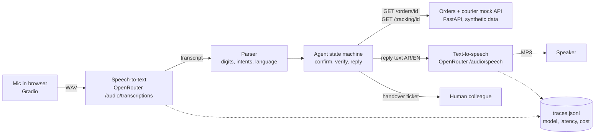

# voice-order-agent

A phone-style voice assistant that tells customers their order status in **Arabic or
English**. It confirms the order number digit by digit, checks the caller, and hands over
to a person when asked or when it cannot help. Every stage of every turn is timed.

## Demo

Demo video/Space: pending — to be recorded by Sara.

The Gradio app (`app/app.py`) takes microphone input and shows the transcript, the tool
calls and the latency of each stage. Without an API key you can still type to the agent.

## The problem

Many order-status calls to an online shop ask one question: "where is my order?". In the
Gulf, those calls come in Arabic and English, often mixing both. A voice bot can answer
them at any hour, but only if it:

- hears order numbers correctly (one wrong digit means the wrong customer's order),
- never reads out an order to someone who cannot prove it is theirs,
- knows when to pass the caller to a person, and
- answers quickly enough that a phone call still feels like a conversation.

This project is a small, measurable version of that bot for a fictional skincare shop,
"Lumi Skin", using synthetic data.

## What it does

- **Speech in, speech out:** OpenRouter speech-to-text (`/api/v1/audio/transcriptions`)
  and text-to-speech (`/api/v1/audio/speech`), both behind one small client with a fake
  for tests.
- **Reads numbers back:** "I heard order number one, zero, one, five, four. Is that
  right?" Corrections such as "no, the order is 10054" are handled.
- **Verifies the caller:** order number plus the last 4 digits of the phone on the order,
  checked against the orders + courier API before any detail is spoken.
- **Arabic and English:** Arabic-Indic digits, Arabic and English digit words
  ("واحد صفر صفر", "one double zero"), and replies in the caller's language.
- **Hands over to a person** on request (any stage, both languages) or after 2 failed
  tries, with a ticket so the caller does not have to repeat themselves.
- **Measures itself:** 30 test calls (15 Arabic, 15 English) run through real
  speech-to-text and text-to-speech, with task success, handover decisions, STT word
  error rate, order-number capture, latency per stage and cost per call.

## Architecture



| Part | File | What it does |
|---|---|---|
| Speech client | `src/voice_agent/audio_client.py` | OpenRouter STT/TTS through the OpenAI SDK; fake client for tests; JSONL traces |
| Parser | `src/voice_agent/parser.py` | Digits (numerals, words, Arabic-Indic), intents, language; no model |
| Agent | `src/voice_agent/agent.py` | State machine: ask, confirm, verify, reply, hand over |
| Replies | `src/voice_agent/replies.py` | All spoken text in English and Arabic |
| Tools | `src/voice_agent/tools.py` | `get_order`, `get_tracking` over HTTP |
| Mock API | `src/voice_agent/mock_api.py` | Minimal copy of the companion project's orders + courier API |
| Pipeline | `src/voice_agent/pipeline.py` | One turn: STT (with the call's language as a hint) → agent → TTS, each stage timed |
| Demo | `app/app.py` | Gradio: microphone, transcript, tool calls, latency |
| Evaluation | `evals/` | 30 test calls, runner, scoring, audio synthesis, STT cross-check of the test audio, cost backfill |

The agent itself uses **rules, not an LLM**: order numbers and phone digits must be exact,
and each LLM call would add another network round trip to every spoken turn. More in
[docs/architecture.md](docs/architecture.md). A live real-time version (OpenAI
`gpt-realtime-2.1-mini`) is planned, not built: [docs/realtime_v2.md](docs/realtime_v2.md).

## Results

Measured on 2026-10-08. All numbers below come from files in `evals/results/`.

### Live voice: the final configuration

- **Speech-to-text:** `elevenlabs/scribe-v2`. **Agent:** rules, no LLM. **Text-to-speech
  (agent):** `elevenlabs/eleven-flash-v2.5`, voice `sarah`.
- **Test callers:** 30 scripted calls voiced by `google/gemini-3.8-flash-lite-tts` (one
  clip by `x-ai/grok-voice-tts-1.0`), 116 clips; 2 calls with fast speech + white noise.
- **Command:** `python -m evals.run --mode audio --tag final`.
  **Files:** `evals/results/audio_elevenlabs_scribe-v2_2026-10-08_final_*`.

| Metric (final run, 30 calls, 110 caller turns) | All | English | Arabic |
|---|---|---|---|
| Task success | 26/30 | 15/15 | 11/15 |
| Correct handover decisions | 26/30 | 15/15 | 11/15 |
| Expected handovers that happened (recall) | 8/8 | 4/4 | 4/4 |
| Status calls handed over by mistake | 4 | 0 | 4 |
| Order status read out in a call that should hand over | 0 | 0 | 0 |
| Confirmed order number = the caller's (calls with one) | 25/28 | 13/14 | 12/14 |
| STT word error rate (normalised, numbers split into digits) | 7.5% (38/506 words) | 5.0% (13/259) | 10.1% (25/247) |
| Turns where STT kept every number exactly | 62/68 | 31/33 | 31/35 |
| Turns where STT kept the order number exactly | 33/35 | 16/17 | 17/18 |
| Reply in the caller's language | 30/30 | 15/15 | 15/15 |
| Latency per turn: speech-to-text, avg / p95 | 651 / 969 ms | 654 / 1006 ms | 648 / 927 ms |
| Latency per turn: agent incl. mock API, avg / p95 | 1.6 / 7.2 ms | 2.0 / 7.6 ms | 1.3 / 6.4 ms |
| Latency per turn: text-to-speech, avg / p95 | 426 / 624 ms | 415 / 615 ms | 437 / 663 ms |
| Latency per turn: total (STT + agent + TTS), avg / p95 | 1079 / 1413 ms | 1071 / 1507 ms | 1087 / 1370 ms |
| Cost per call (STT + TTS of the agent's replies) | US$0.0061 | US$0.0068 | US$0.0055 |

The 4 failed calls are all Arabic: twice `scribe-v2` wrote the one-word answer "نعم" (yes)
as "نام؟" or "نان؟", and twice the caller said a number in tens or as a quantity
("سبعة وعشرين تسعين" for 2790, "عشرة آلاف وعشرون" for 10020), which the rules cannot read.
In every failed call the agent handed over to a person; it never read out a status it
should not have.

How to read this honestly:

- **Small, self-made test set.** 30 calls, written by the same coding agent that built the
  parser. The Arabic scripts and the Arabic agent voice have not been reviewed by a native
  speaker.
- **No held-out set.** The 5 code fixes, the choice of STT model and the re-made test clips
  were all decided on these same 30 calls, so 26/30 is optimistic. The earlier runs are
  listed below so you can see each step.
- **Run-to-run noise is about ±1 call.** The same setup scored 24 and 23 (runs 3d and 4)
  and 25 and 26 (runs 6 and 7); STT and network latency also vary between runs.
- **Synthetic callers are cleaner than phone calls.** The caller audio is studio-quality
  TTS at 24 kHz (plus white noise on 2 calls), not 8 kHz phone audio with real accents.
- **Scripted callers do not adapt.** After a mishearing the next scripted line may no
  longer fit, so one STT error usually ends in a handover. Real callers would repeat
  themselves, so live task success is a lower bound in that sense.
- **Latency** is measured from sending the caller's audio to receiving the whole reply
  audio, from a cloud machine; it excludes recording, network to the caller and playback.
  No streaming yet.

### Every live run, in order

Same 30 calls each time unless stated. "Fixes" are listed in the next section. Cost is
OpenRouter's reported cost: STT from `usage.cost`; TTS from the generation API, or
characters × US$20 per 1M for the 136 of 1,132 replies whose generation record never
appeared (that price matched OpenRouter's figure on all 996 replies that had one).

| Run | STT model | Code | Test audio | Task success: all (EN, AR) | STT WER | Order-ID capture per turn | STT avg / p95 ms | Turn total avg / p95 ms | Cost per call | Run cost |
|---|---|---|---|---|---|---|---|---|---|---|
| 0. smoke, 3 calls | `openai/gpt-4o-transcribe` | as built | original | 0/3 (0/1, 0/2) | 22.5% | 2/3 | 514 / 917 | 891 / 1301 | US$0.0044 | US$0.013 |
| 1. before fixes | `openai/gpt-4o-transcribe` | as built | original | 14/30 (9/15, 5/15) | 16.2% | 22/34 | 519 / 886 | 932 / 1401 | US$0.0052 | US$0.156 |
| 2. fixes 1-3 | `openai/gpt-4o-transcribe` | fixes 1-3 | original | 16/30 (9/15, 7/15) | 13.2% | 24/33 | 499 / 716 | 899 / 1130 | US$0.0052 | US$0.156 |
| 3a. STT comparison | `openai/gpt-4o-transcribe` | fixes 1-4 | original | 18/30 (11/15, 7/15) | 13.6% | 24/33 | 543 / 831 | 977 / 1293 | US$0.0053 | US$0.160 |
| 3b. STT comparison | `openai/gpt-transcribe` | fixes 1-4 | original | 21/30 (13/15, 8/15) | 6.5% | 25/33 | 550 / 906 | 953 / 1352 | US$0.0061 | US$0.182 |
| 3c. STT comparison | `openai/whisper-large-v3` | fixes 1-4 | original | 22/30 (13/15, 9/15) | 8.0% | 26/35 | 738 / 1239 | 1187 / 1988 | US$0.0064 | US$0.193 |
| 3d. STT comparison | `elevenlabs/scribe-v2` | fixes 1-4 | original | 24/30 (14/15, 10/15) | 8.5% | 28/34 | 557 / 786 | 981 / 1256 | US$0.0058 | US$0.174 |
| 4. repeat of 3d | `elevenlabs/scribe-v2` | fixes 1-4 | original | 23/30 (14/15, 9/15) | 6.7% | 27/33 | 742 / 1130 | 1162 / 1622 | US$0.0057 | US$0.170 |
| 5. 5 bad clips re-made | `elevenlabs/scribe-v2` | fixes 1-4 | 5 clips re-made | 26/30 (15/15, 11/15) | 7.8% | 32/35 | 632 / 1011 | 1100 / 1586 | US$0.0060 | US$0.179 |
| 6. all number clips checked | `elevenlabs/scribe-v2` | fixes 1-4 | 8 clips re-made | 25/30 (15/15, 10/15) | 6.4% | 34/36 | 660 / 907 | 1082 / 1387 | US$0.0062 | US$0.186 |
| 7. repeat of 6 | `elevenlabs/scribe-v2` | fixes 1-4 | 8 clips re-made | 26/30 (15/15, 11/15) | 7.0% | 34/36 | 696 / 1085 | 1189 / 1761 | US$0.0062 | US$0.186 |
| 8. final | `elevenlabs/scribe-v2` | fixes 1-5 | 8 clips re-made | 26/30 (15/15, 11/15) | 7.5% | 33/35 | 651 / 969 | 1079 / 1413 | US$0.0061 | US$0.184 |

All runs: TTS `elevenlabs/eleven-flash-v2.5`. Files: `evals/results/audio_<stt model>_2026-10-08_<tag>_*`
(run 0 in `evals/results/smoke/`). Making the test audio cost US$0.054 (130 TTS requests,
`evals/results/synthesis_2026-10-08_summary.json`). The denominators of the per-turn STT
metrics change between runs because a call stops early when it ends in a handover.

### Text only (no speech)

The 30 scripts typed straight into the agent: 30/30 task success (15/15 per language),
28/28 order numbers captured, 30/30 handover decisions, 0 status leaks, agent latency
avg 1.44 ms, p95 6.33 ms (116 turns, in-process mock API). Command:
`python -m evals.run --mode text`; files: `evals/results/text_after_fixes/` (after the
fixes) and `evals/results/text_only_2026-10-08_*` (build version, same scores). This only
shows the dialogue logic matches its own scripts.

Metric definitions are in `evals/scoring.py`.

## What failed and what I changed

The first live run scored **14/30** (English 9/15, Arabic 5/15); the text-only run had
scored 30/30 on the same scripts. Real speech-to-text broke things the scripts never
showed. In order:

- **The default TTS model did not exist.** `openai/gpt-4o-mini-tts-2025-12-15`, taken
  from OpenRouter's docs, returned HTTP 400 "does not exist" and was missing from the
  live list of speech models. I checked `/api/v1/models?output_modalities=speech` and
  `=transcription`, probed three Arabic-capable voices, and chose
  `elevenlabs/eleven-flash-v2.5` for the agent (about 0.35 s per reply in the probe;
  Gemini TTS took about 2.5 s). Lesson: read the live model list, not the example in
  the docs.
- **Fix 1: "LS10154".** STT drops the hyphen in "LS-10154", and the parser read
  "LS10154" as one word with no number in it. It now splits letters from digits.
- **Fix 2: commas between spoken digits.** STT wrote "ثمانية، ثلاثة، خمسة، صفر" with
  Arabic commas, which broke the phone digits into four 1-digit numbers. Digit words now
  join across a comma.
- **Fix 3: one-word answers came back in the wrong language.** "نعم" (yes) came back as
  "Neam.", "Na.", "Nam" or "Hey,", and "That's right." as German "Das Red.". A one-second
  clip is too short for STT to guess the language. From the second turn on, the call's
  language is now sent as a hint. That alone did not help: `openai/gpt-4o-transcribe`
  **ignored the hint** (still "Na.", "Nan" and "Das reicht!" with it, sent as multipart
  or JSON). Three
  other models (`whisper-large-v3`, `gpt-transcribe`, `scribe-v2`) followed it and got
  "نعم" and "That's right." right, so I compared all four on the full set (runs 3a-3d)
  and switched to `elevenlabs/scribe-v2`, which scored best (24/30 against 18-22) and
  often writes spoken quantities as numerals. `gpt-4o-transcribe` also turned the two
  noisy calls into Polish, Swedish, Hungarian, German or Japanese text in every run; the
  other three models got the first noisy turn right.
- **Fix 4: phone endings in pairs became times.** "1035" said as "ten thirty-five" came
  back as "10:35" from all four models. Numerals around a colon now join.
- **The test audio itself was wrong in 8 clips.** When a call failed on a number, I sent
  the clip to all four STT models. When all of them heard the same wrong thing, the TTS
  caller voice had misread the script. Examples: "10004" said as "one zero zero four",
  "10020" said as "100200", and "0067" replaced by the sentence "Alright, that's the
  order number.". Fixing only the clips that failed would be biased, so I checked every
  clip with a number (72) with three STT models (`python -m evals.crosscheck_stt
  --all-with-digits`), reviewed the flags by hand (readings in pairs or as quantities are
  valid and were kept), and re-made the 8 bad clips. One clip ("10020" in Arabic) failed
  4 Gemini attempts and was made with `x-ai/grok-voice-tts-1.0`. Lesson: check synthetic
  test audio before trusting a score. One rejected clip is kept in
  `evals/audio_samples/`.
- **Fix 5: digits in English words switched an Arabic call to English.** In run 6,
  `scribe-v2` returned an Arabic caller's "9026" as "nine zero two six". Those four words
  counted as an English sentence, so the handover message was spoken in English. Number
  words no longer count when deciding the language.
- **Cost tracking.** The speech endpoint returns audio with no usage, so the first version
  could not report TTS cost. The runner now looks up each reply's cost through
  OpenRouter's generation API. Some records arrive minutes late or never, so
  `python -m evals.recost` fills them in afterwards.

Each fix has a regression test built from the real transcript (`tests/test_parser.py`,
`tests/test_agent.py`, `tests/test_pipeline_and_client.py`). Still failing: numbers said
in tens or as quantities (3 `xfail` tests mark the gap), "نعم" written as "نام؟" or "نان؟"
by `scribe-v2`, and STT under heavy noise.

> TODO (Sara): after the live run, add 2–3 real failures from `evals/results/*_turns.jsonl`
> and what you changed.

## How to run

```bash
python -m venv .venv && source .venv/bin/activate   # Windows: .venv\Scripts\activate
pip install -e ".[app,dev]"
pytest -q && ruff check .
python -m evals.run --mode text                      # text-only evaluation (no key needed)
python app/app.py                                    # demo at http://127.0.0.1:7860
```

With an OpenRouter key in `Portfolio Projects/.env` (or a local `.env`, see `.env.example`):

```bash
python -m evals.synthesize_audio --plan   # preview files and characters, no API calls
python -m evals.synthesize_audio          # make the 30 test calls' audio with TTS (~US$0.05)
python -m evals.run --mode audio          # live STT -> agent -> TTS (~US$0.19 for 30 calls)
```

- Default models (set in `.env` to change, see `.env.example`): STT `elevenlabs/scribe-v2`,
  agent voice `elevenlabs/eleven-flash-v2.5` (voice `sarah`), test-caller voices
  `google/gemini-3.8-flash-lite-tts`. Compare another STT model with
  `python -m evals.run --mode audio --stt-model openai/whisper-large-v3 --tag mytest`.
- Check the test audio before trusting a score: `python -m evals.crosscheck_stt
  --all-with-digits --models openai/whisper-large-v3 openai/gpt-transcribe
  openai/gpt-4o-transcribe`, listen to the flagged clips, and re-make bad ones with
  `python -m evals.synthesize_audio --only en07/turn_1`. TTS output differs every time,
  so a fresh synthesis needs this check again.
- `python -m evals.recost evals/results/<run>_turns.jsonl` fills in TTS costs whose
  OpenRouter record was not ready when the run finished.
- The budget guard stops a run above `MAX_COST_PER_RUN_USD`. Agent replies are saved as
  `evals/audio/<call>/reply_<n>.mp3` (git-ignored); a few samples are in
  `evals/audio_samples/`.

`python -m evals.run --mode audio --dry-run` runs the whole voice pipeline with a fake
speech client (no key, no network) and writes to `evals/dry_run/`. Those files prove the
pipeline works; they are **not** results.

To run the mock API as its own server (as in the companion project):
`uvicorn voice_agent.mock_api:app --port 8001`, then set `ORDER_API_URL=http://127.0.0.1:8001`.

## Data and licence

- All data is **synthetic**: shared synthetic Lumi Skin data, generated by `generate.py`
  (seed 42). Fake people use `@example.com` emails and `+971 50 000 xxxx` phones. See
  [data/README.md](data/README.md).
- The mock API returns only the last 4 phone digits, never names, emails or addresses.
- Test-call audio is generated with TTS and is not committed (about 15 MB), except 9 small
  sample clips in `evals/audio_samples/` (about 1.4 MB). Any real voice recording (for
  example Sara's own) is used only with consent and kept out of git.
- Code and data: MIT licence, see [LICENSE](LICENSE).

## How I used AI agents

> DRAFT for Sara to edit. Keep it true.

- **Brief and acceptance tests:** I (Sara) wrote the brief and the
  acceptance tests in the build spec: the call flow, verification with the last 4 phone
  digits, reading numbers back, handover after 2 failed tries, and the 30-call
  evaluation with per-stage latency.
- **First version of the code:** a coding agent (Claude) generated the first version of
  the code, tests, evaluation runner and documentation on 8 October 2026, working from
  that brief. It ran the tests and the text-only evaluation.
- **My review:** I review, run and change the code before publishing.

> TODO (Sara): list what you changed after reviewing.
>
> TODO (Sara): note which parts you rewrote yourself and which you kept.

## Limitations and next steps

- **Test on held-out and real calls.** Every choice so far was made on the same 30
  synthetic calls. Next: a fresh set of calls (ideally Sara's own consenting recordings
  and other Gulf Arabic speakers, at phone quality) scored once, with no changes in
  between.
- **Numbers in tens and quantities.** All 4 failures in the final run are Arabic: 2 are
  numbers said in tens or as quantities ("سبعة وعشرين تسعين"), which the rules do not read.
  When the rules cannot read a number, the bot currently asks again but does not say
  "digit by digit" for the phone. Next: a small number-words parser (the 3 `xfail` tests
  show the target) or an LLM fallback only for turns the rules cannot parse, measured for
  accuracy and latency.
- **Short Arabic answers.** `scribe-v2` sometimes writes "نعم" as "نام؟" or "نان؟". Options:
  a second STT opinion for one-word turns, or a yes/no button on a phone keypad (DTMF).
- **About 1.1 s per turn before the reply can play** (final run avg 1079 ms, p95 1413 ms):
  roughly 60% STT, 40% TTS. Next: stream TTS audio, cache the fixed prompts (they are
  the same every call), and try version 2 (real-time).
- **Language detection** uses the script of the transcript; a caller who only says digits
  starts in English until they say a sentence.
- **Mock data and API.** A real deployment needs a real order system, authentication,
  rate limits and a real handover queue.
- **Synthetic voices** are cleaner than real callers, and the TTS voices themselves misread
  numbers (8 of 116 clips had to be re-made). Add consenting human recordings, Gulf dialect
  variety and phone-line audio quality.
