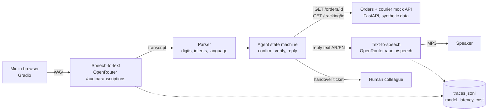
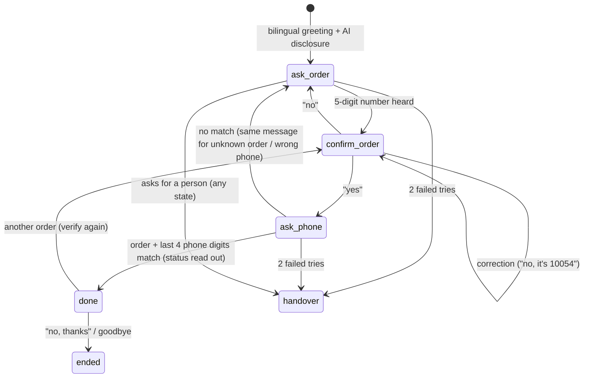

# Architecture

## Version 1: turn-based voice (built)

Each spoken turn runs three stages in order, and each is timed separately
(`src/voice_agent/pipeline.py`):

1. **Speech-to-text** (`audio_client.py`): the caller's audio goes to OpenRouter's
   OpenAI-compatible transcription endpoint (multipart upload). Default model:
   `openai/gpt-4o-transcribe` (set `MODEL_STT`).
2. **Agent** (`parser.py`, `agent.py`, `tools.py`, `replies.py`): deterministic rules, no
   LLM. The parser turns the transcript into digits, intents and a language guess. The
   agent is a state machine:

3. **Text-to-speech**: the reply goes to OpenRouter's speech endpoint with delivery
   instructions (calm, read digits slowly; Arabic with a neutral Gulf-friendly accent).
   Default model: `openai/gpt-4o-mini-tts-2025-12-15` (set `MODEL_TTS`).

### Why the agent has no LLM

- Order numbers and phone digits must be exact; rules are testable and auditable.
- An LLM call per turn would add a fourth network round trip to every spoken turn.
- The spoken replies are fixed templates, so nothing personal (name, address, amount)
  can be said by accident, and the Arabic wording was written, not generated.

The trade-off: the parser only understands the phrasings it was written for. A caller who
says "ten thousand and forty-five" is asked to say the digits one by one. An LLM-based
fallback for unclear turns is listed under next steps in the README.

### Safety and privacy decisions

- Details only after the order number **and** the last 4 phone digits match.
- The same "couldn't match" message for an unknown order and a wrong phone, so the bot
  cannot be used to discover which order numbers exist.
- The mock API exposes only the last 4 phone digits (data minimisation).
- `hmac.compare_digest` for the digit check (constant time).
- Two failed tries → handover; a request for a person → handover at any point, with a
  ticket (reason, language, order number, verified yes/no) so the caller need not repeat.
- The greeting says the caller is talking to an automated assistant.

## Version 2: live real-time voice (not built)

See [realtime_v2.md](realtime_v2.md).
